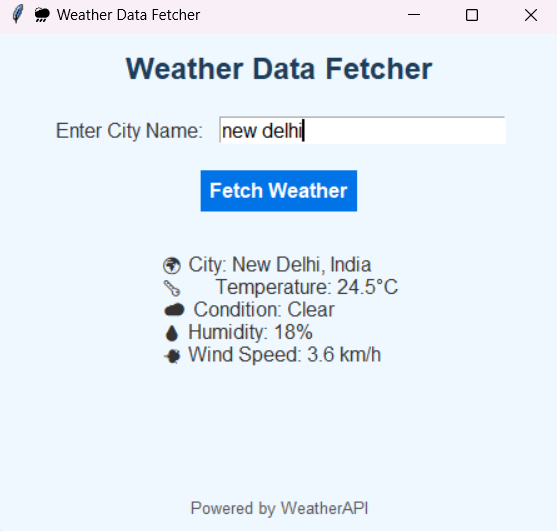
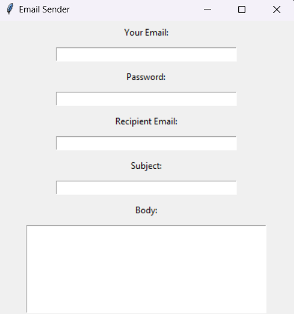
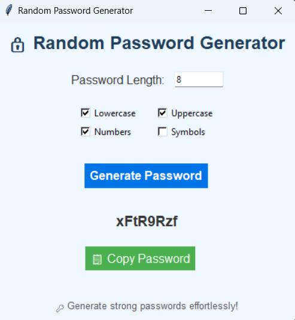

# 🌟 Project Showcase: Collection of Useful Applications

Welcome to the **Project Showcase**, a curated collection of handy applications to simplify your daily tasks. Each project comes with an intuitive interface and practical functionality. Below are the links to explore and use these applications, along with placeholders for screenshots of the respective projects.

---

## 🌦️ [Weather App](https://sid-cloud13.github.io/Weather_App/)

**Description**: A simple weather application to fetch real-time weather data for any city using the WeatherAPI. Displays temperature, humidity, wind speed, and conditions.  

**Features**:
- Fetch current weather by city name.
- Real-time temperature, humidity, and wind details.
- User-friendly design.

**🔗 Access**: [Weather App](https://sid-cloud13.github.io/Weather_App/)

**📸 Screenshot**:  

---

## ✉️ [Mail Sender](https://sid-cloud13.github.io/Mail_Sender/)

**Description**: A secure and easy-to-use email sending application. Send personalized emails using your Gmail account with just a few clicks.

**Features**:
- Send emails with a custom subject and body.
- Supports authentication via Gmail.
- Error handling for invalid inputs.

**🔗 Access**: [Mail Sender](https://sid-cloud13.github.io/Mail_Sender/)

**📸 Screenshot**:  

---

## 🔒 [Password Generator](https://sid-cloud13.github.io/Password_generator/)

**Description**: Generate strong, random passwords tailored to your needs. Perfect for improving online security and safeguarding sensitive accounts.

**Features**:
- Customizable password length.
- Options to include lowercase, uppercase, numbers, and symbols.
- Clipboard functionality for easy password copying.

**🔗 Access**: [Password Generator](https://sid-cloud13.github.io/Password_generator/)

**📸 Screenshot**:  

---

## 💰 [Expense Tracker](https://sid-cloud13.github.io/Expenses_traker/)

**Description**: Keep track of your daily expenses with this handy tool. Categorize, save, and load expense data easily to monitor your spending.

**Features**:
- Add expenses with categories, descriptions, and dates.
- View expenses in a table format.
- Save and load expenses to/from CSV files.

**🔗 Access**: [Expense Tracker](https://sid-cloud13.github.io/Expenses_traker/)

**📸 Screenshot**:  

---

## 🛠️ Contribution

Feel free to contribute to this project collection!  
- Fork the repository, make your improvements, and submit a pull request.  
- Report bugs or suggest features in the **Issues** section.  

---

## 🌟 Acknowledgments

Thank you for exploring the **Project Showcase**! Your support motivates us to build more helpful applications. 🙌

